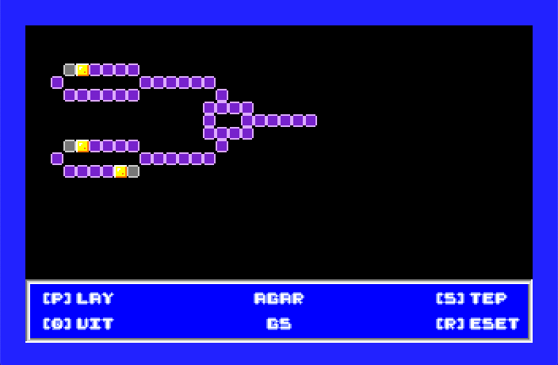

# Agar.GS
A cellular automata program for the Apple IIGS. Not yet released.

This is my Slackfest un-contest un-entry for KansasFest/A24EVR 2023.

This was inspired by finding multiple highly intriguing mentions of Brian Silverman's Phantom Fish Tank program for the Apple II... but not being able to find any manuals or copies online. So, this is not the greatest Apple II cellular automata program in the world, no; this is just a Slackfest tribute for the Apple IIGS.


## Screen Shots

There is no manual for Agar.GS. The screenshots below attempt to capture key parts of running the program.



When first opened, Agar.GS is paused and will statically display the contents of the initial Agar Plate. The following commands are available:

1. [P] lay / [P] ause - the [P] key will toggle between playing and pausing the evaluation of the rules.
2. [R] eset - the [R] key will reset the plate to its original state.
3. [S] tep - the [S] key will step forward one generation of cellular automata on the plate using the rules.
4. [Q] uit - the [Q] key will quit Agar.GS.

For reference, this is a screenshot of the game when running after the [P] key has been pressed once:


## Included Examples

In the _Examples_ folder are a few subfolders with example `RULES` and `PLATE` files. Copy *both* files to the top level, overwriting those `RULES` and `PLATE` files to run a given example. The default top level files are from the _WireWorld_ example.

### Brian's Brain

For more information: [Brian's Brain Wikipedia Article](https://en.wikipedia.org/wiki/Brian%27s_Brain)


### Conway's Game of Life

For more information: [Conway's Game of Life Wikipedia Article](https://en.wikipedia.org/wiki/Conway%27s_Game_of_Life)


### Seeds

For more information: [Seeds Wikipedia Article](https://en.wikipedia.org/wiki/Seeds_(cellular_automaton))


### Wire World

For more information: [Wire World Wikipedia Article](https://en.wikipedia.org/wiki/Wireworld)


## Constucting Rules and Plates

An understanding of [Cellular Automata](https://en.wikipedia.org/wiki/Cellular_automaton) may help in understanding the starting plate and the rules.

For Agar.GS, the values 0 through 7 represent _dead_ cells and the values 8 through 15 represent _live_ cells.

Rules and plates are defined in plain text files. Plates define a starting configuration of cells using a 20 row by 40 column grid of hexadecimal values. As an example, a simple glider plate for Conway's Game of Life might look like the following:

```
0000000000000000000000000000000000000000
00F0000000000000000000000000000000000000
000F000000000000000000000000000000000000
0FFF000000000000000000000000000000000000
0000000000000000000000000000000000000000
0000000000000000000000000000000000000000
0000000000000000000000000000000000000000
0000000000000000000000000000000000000000
0000000000000000000000000000000000000000
0000000000000000000000000000000000000000
0000000000000000000000000000000000000000
0000000000000000000000000000000000000000
0000000000000000000000000000000000000000
0000000000000000000000000000000000000000
0000000000000000000000000000000000000000
0000000000000000000000000000000000000000
0000000000000000000000000000000000000000
0000000000000000000000000000000000000000
0000000000000000000000000000000000000000
0000000000000000000000000000000000000000
```
Where the _dead_ cells are indicated by the value `0` and the _live_ cells are indicated by the value `F`.

Similarly, the rules for Conway's game of life would look like so:

```
000F0000
00000000
00000000
00000000
00000000
00000000
00000000
00000000
00000000
00000000
00000000
00000000
00000000
00000000
00000000
00FF0000
```

Where the row indicates the starting value for a cell and the 8 values in row indicate the next value for that cell depending on how many neighbors it has in the current generation.

## Dev Environment

This project is currently developed in [Xcode](https://developer.apple.com/xcode/) on OSX using:

* [Apple2GSBuildPipeline](https://github.com/jeremysrand/Apple2GSBuildPipeline) build system by Jeremy Rand
* [Golden Gate](https://goldengate.gitlab.io/about/) compatibility layer by Kelvin Sherlock
* [ORCA/C](https://juiced.gs/vendor/byteworks/) compiler and libraries by The Byte Works
* [ORCA/C 2.2.0 B6 update](https://github.com/byteworksinc/ORCA-C/releases/tag/orcac-220b6) by Stephen Heumann

and tested on [GSplus](https://apple2.gs/plus/) and a physical ROM03 machine

# Runtime Environment

* System 6.0.1 as included in [Apple2GSBuildPipeline](https://github.com/jeremysrand/Apple2GSBuildPipeline)
* [GTE / Tool 160 Beta 1 (KansasFest Edition) - Orca C Demo Branch Build](https://github.com/lscharen/iigs-game-engine/tree/create-orca-c-demo) by Lucas Scharenbroich